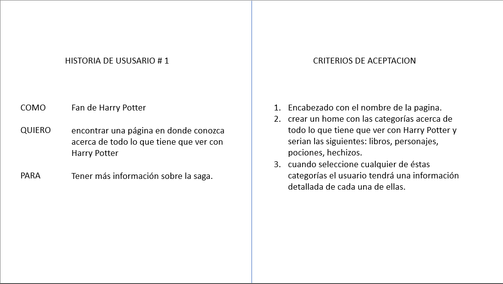
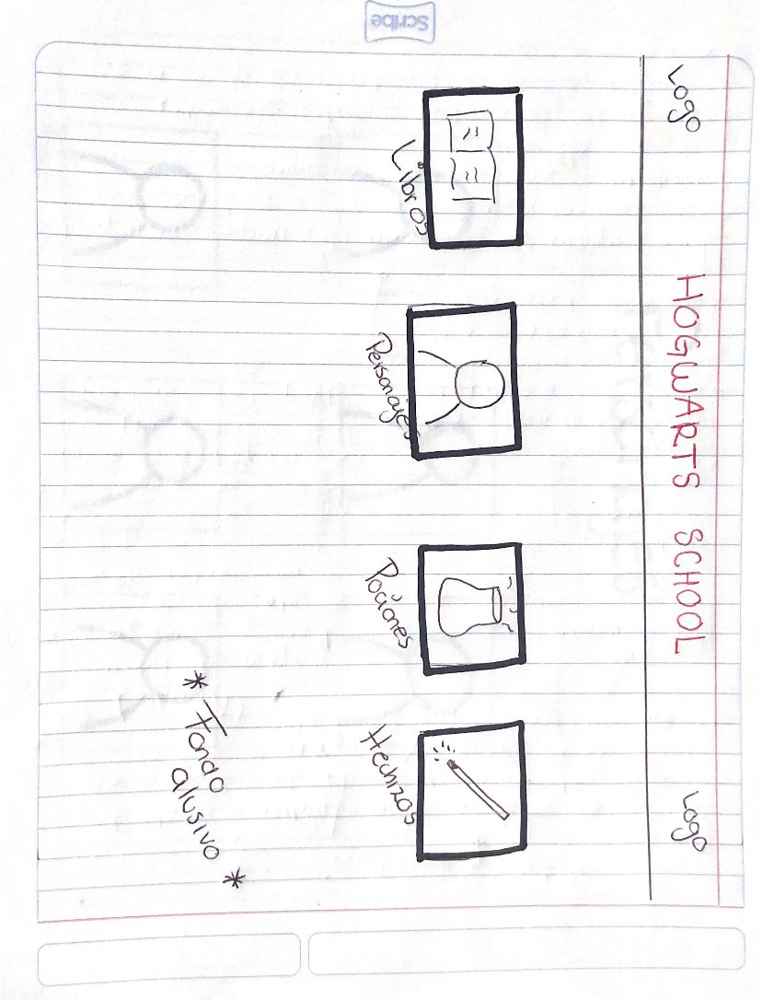
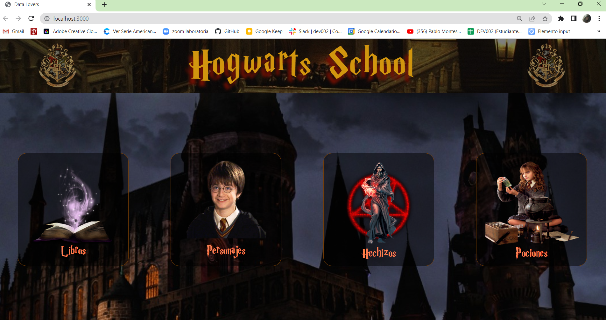
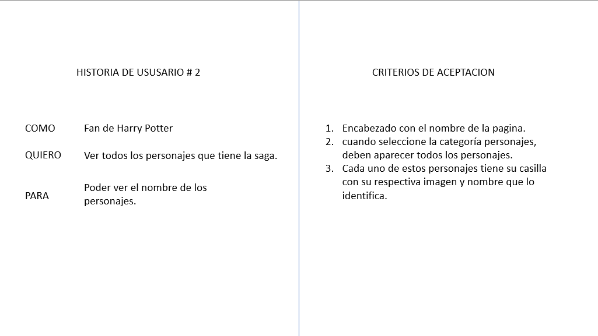
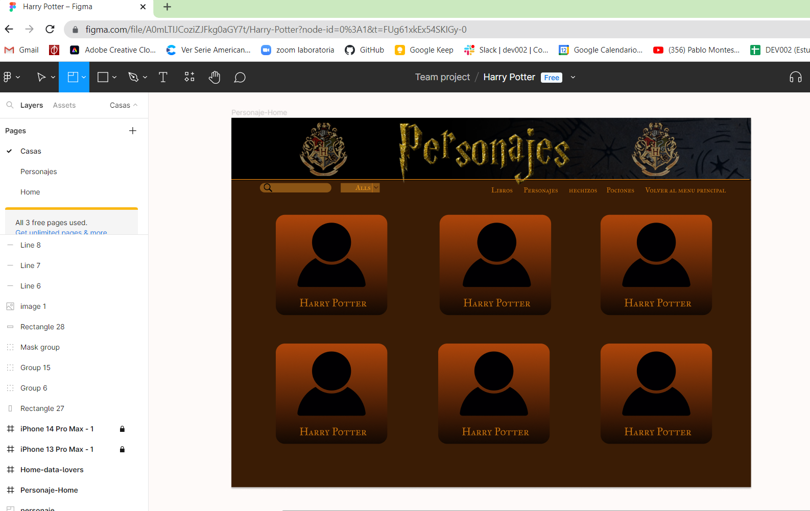
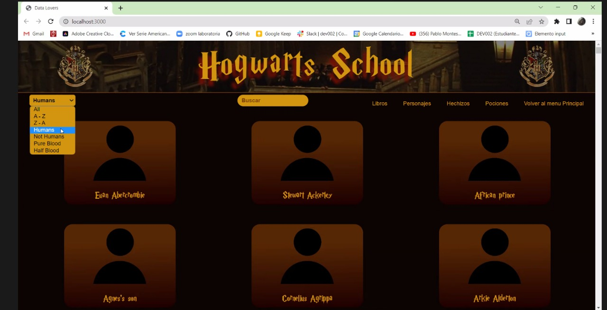

# Data Lovers

## Welcome to Hogwarts School

## Introducción

El siguiente proyecto está orientado a mostrar data sobre el mundo de Harry Potter a los interesado o fánaticos de esta famosa saga de manera más interactiva en una interfaz amigable para el usuario.

## ¿Quiénes son los principales usuarios de producto?

De acuerdo a la investigación realizada por medio de internet, se logró definir a los usuarios objetivos de este tipo de contenido, resultando en fanáticos de Harry Potter (Potterheads) y cinéfilos conocedores de la saga.

## ¿Cuáles son los objetivos de estos usuarios en relación con el producto?

En esta investigación, se logró definir las preferencias del usuario al revelarnos qué tipo de información deseaban encontrar en la página web. Las siguientes historias de usuario muestran de forma detalla todo lo que se pudo definir, los criterios de aceptación y definición de terminado para cumplir con los requerimientos de los usuarios.

## HISTORIAS DE USUSARIOS
 

### primer usuario

 
 

### Definión de terminado

1. La pagina cuenta con un encabezado con el nombre de la escuela.
2. la pagina tiene en el Home las cuatro opciones funcionales.
3. el código de la parte del Home fué testeado obteniendo un 100% de manera general.
4. la pagina cuenta con Mediaquerys para usuarios de laptop y Mobile.

 

 
 

### segundo usuario

 
 

### Definición de terminado

1. cuenta con una tarjeta de código funcional que contiene el nombre y la imagen de los personajes.
2. estas tarjetas se acomodaron con una grid para las diferentes tipos de pantalla.
3. El código tiene y pasa los test necesarios para mostrar todos los personajes.

 

 
 

### Tercer ususario

 
 

### Definición de terminado

1. cuenta con un select
2. Se divide por clases: All, Humans, Not humans, Pure blood, Half blood.
3. se puede organizar de orden alfabetico y visceversa.
4. se logra pasar cada uno de los test sobre las filtraciones de las especies.

 

 
 

### Cuarto usuario

 

### Definición de terminado

 

1. cuenta con un buscador
2. la busqueda será por nombre
3. se programó en el codigo que las búsquedas fueran sólo en minúsculas.
4. el programa lanza el personaje buscado
5. pasan los test sobre las funciones de busqueda

 

    

